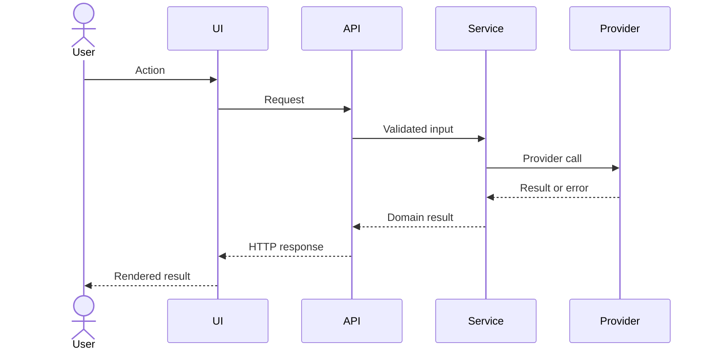

# Open WebUI — Sequence diagram

Диаграмма должна отражать проверенный control/data flow.

```mermaid
sequenceDiagram
    actor User
    participant UI
    participant API
    participant Service
    participant Provider
    User->>UI: Action
    UI->>API: Request
    API->>Service: Validated input
    Service->>Provider: Provider call
    Provider-->>Service: Result or error
    Service-->>API: Domain result
    API-->>UI: HTTP response
    UI-->>User: Rendered result
```

## Подтверждающие file/symbol paths

## Failure/cancellation path
